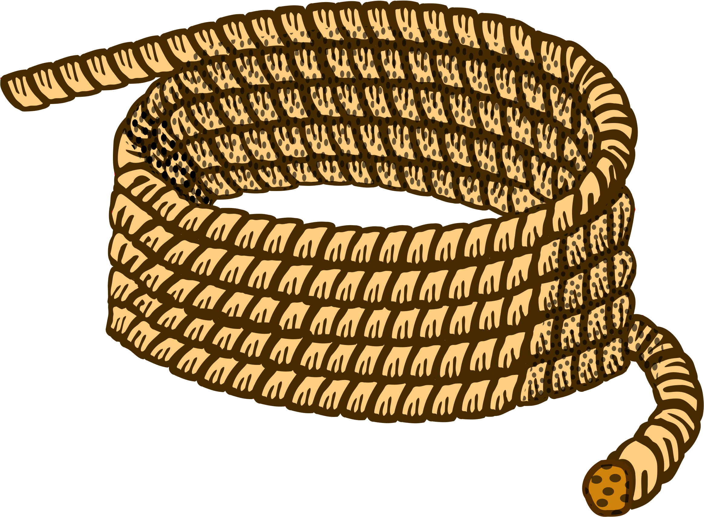

# rust-counter-strings

Counter strings generator written in [rust](https://www.rust-lang.org/) to help aid software testing

## What is a counterstring?

> "A counterstring is a graduated string of arbitrary length. No matter where you are in the string, you always know the character position. This comes in handy when you are pasting huge strings into fields and they get truncated at a certain point" - [James Bach](https://www.satisfice.com/blog/archives/22)

## How do I use a counterstring?

> "Each asterisk in the string occurs at a position specified by the immediately preceding number. Thus, the asterisk following the 29 is the 29th character in that string. So, you can chop the end of the string anywhere, and you know exactly where it was cut. Without having to count, you know that the string `2*4*6*8*11*14*17*2` has exactly 18 characters in it. This saves some effort when you’re dealing with a half million characters. I pasted a 4000 character counterstring into the address field and it was truncated at `2045*20`, meaning that 2047 characters were pasted." - [James Bach](https://www.satisfice.com/blog/archives/22)

## Docker Usage

- `docker pull thomaschaplin/rust-counter-strings`
- `docker run --rm thomaschaplin/rust-counter-strings <NUMBER>`

## Development Setup

Make sure you have [rust](https://www.rust-lang.org/) installed on your machine by following the [getting started guide](https://www.rust-lang.org/learn/get-started)

### Instructions

* Clone this repository `git clone git@github.com:thomaschaplin/rust-counter-strings.git`
* Change directory `cd rust-counter-strings`
* Build the application `cargo build`
* Run the application `cargo run <NUMBER>`

### Final Build

* Build the application in release mode `cargo build --release`
* Execute the `rust-counter-strings` binary file found in `target/release/rust-counter-strings`

#### Example Usage:

`./rust-counter-strings 50`

```
2*4*6*8*11*14*17*20*23*26*29*32*35*38*41*44*47*50*
```

### Local Docker Setup

Build
```
docker build --rm -f Dockerfile -t thomaschaplin/rust-counter-strings .
```

Run
```
docker run --rm thomaschaplin/rust-counter-strings <NUMBER>
```

---

[Rope](https://www.clipartkey.com/view/imioim_rope-lasso-clipart-rope-black-and-white/) graphic by <a href="https://www.clipartkey.com/upic/322/">Alpenx Nbr</a> from ClipArtKey.
